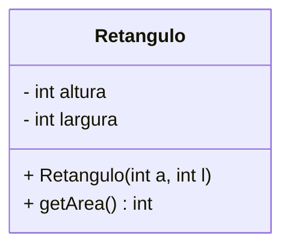
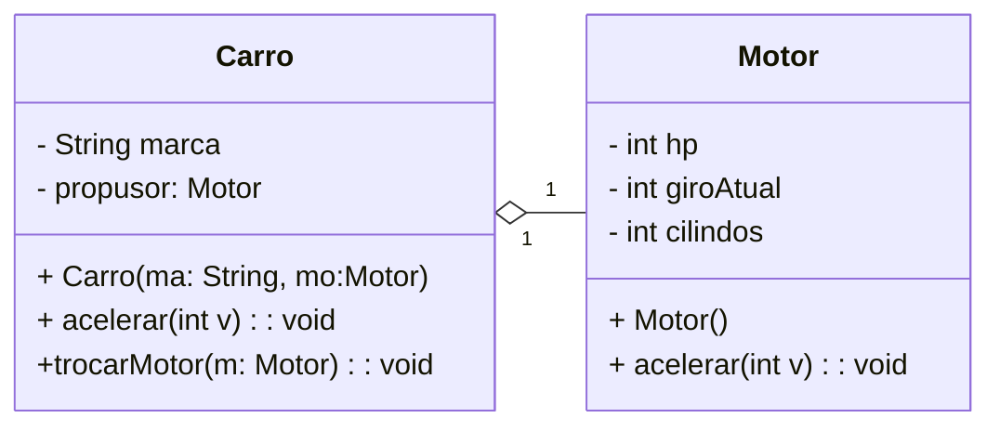

# Diagrama de classes UML

```mermaid
classDiagram
    
    class Retangulo{
        - int altura
        - int largura
        + Retangulo(int a, int l)
        + getArea() int
    }

```

```mermaid

classDiagram
    direction LR
    class Carro{
        - String marca
        - propusor: Motor
        + Carro(ma: String, mo:Motor)
        + acelerar(int v): void
        +trocarMotor(m: Motor): void
    }
    
    class Motor{
        - int hp
        - int giroAtual
        - int cilindos
        + Motor()
        + acelerar(int v): void
    }
    
    Carro "1" o-- "1" Motor
```