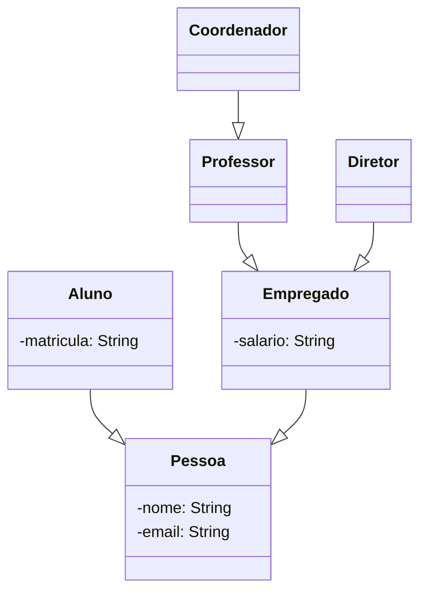
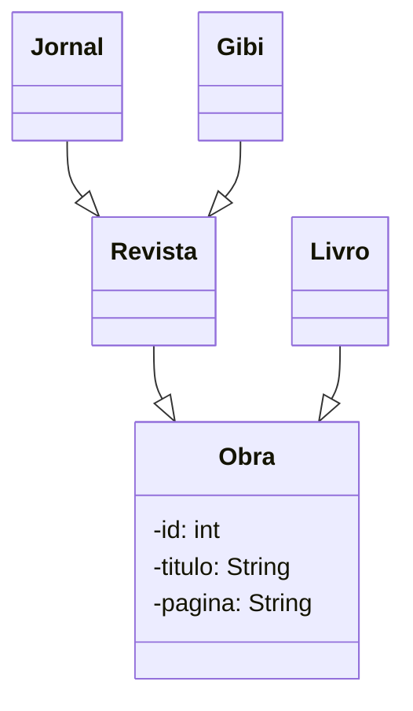

```mermaid

classDiagram
    
    class Aluno{
        -matricula: String
    }
    
    class Professor{
       
    }
    
    class Empregado{
        -salario: String
    }
    
    class Coordenador{
        
    }
    
    class Diretor{
        
    }
    
    class Pessoa{
        -nome: String
        -email: String
    }
    
    Aluno --|> Pessoa
    Empregado --|> Pessoa
    Professor --|> Empregado
    Diretor --|> Empregado
    Coordenador --|> Professor

```

```mermaid

classDiagram
    
    class Livro{
        
    }
    
    class Revista{
        
    }
    
    class Jornal{
        
    }
    
    class Gibi{
        
    }
    
    class Obra{
        -id: int
        -titulo: String 
        -pagina: String 
    }
    
    Jornal --|> Revista
    Gibi --|> Revista
    Revista --|> Obra
    Livro --|> Obra

```