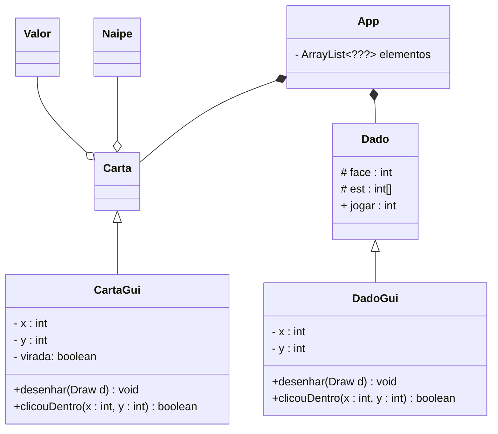

```mermaid
classDiagram
    direction TB

    App *-- Carta
    App *-- Dado
    Carta <|-- CartaGui
    Naipe --o Carta
    Valor --o Carta
    Dado <|-- DadoGui

    class App{
        - ArrayList~???~ elementos        
    }
    
    class Dado{
        # face : int
        # est : int[]
        + jogar : int
    }

    class DadoGui{
        - x : int
        - y : int
        +desenhar(Draw d) void
        +clicouDentro(x : int, y : int) boolean
    }

    class CartaGui{
        - x : int
        - y : int
        - virada: boolean
        +desenhar(Draw d) void
        +clicouDentro(x : int, y : int) boolean
    }

```
